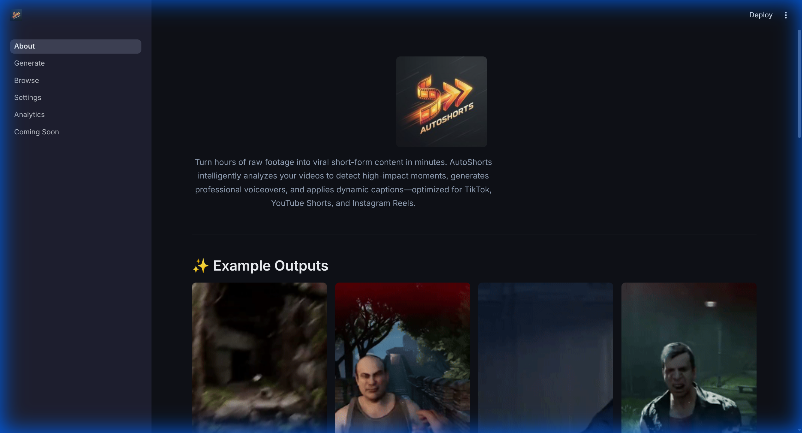
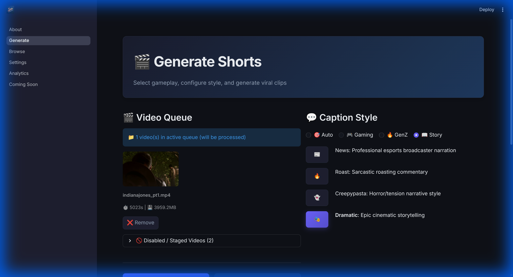
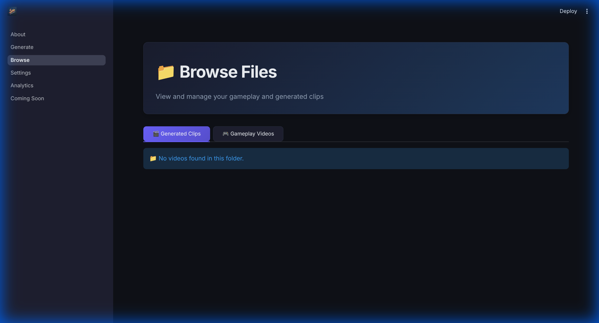
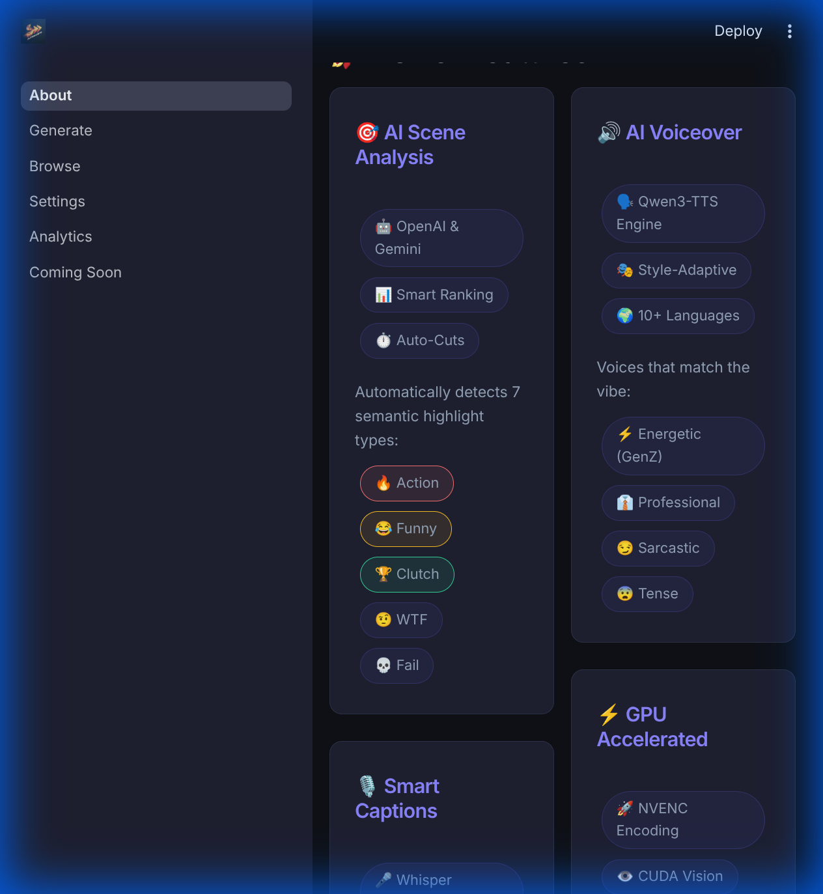
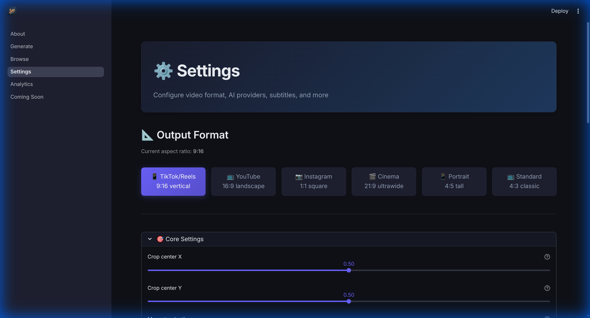
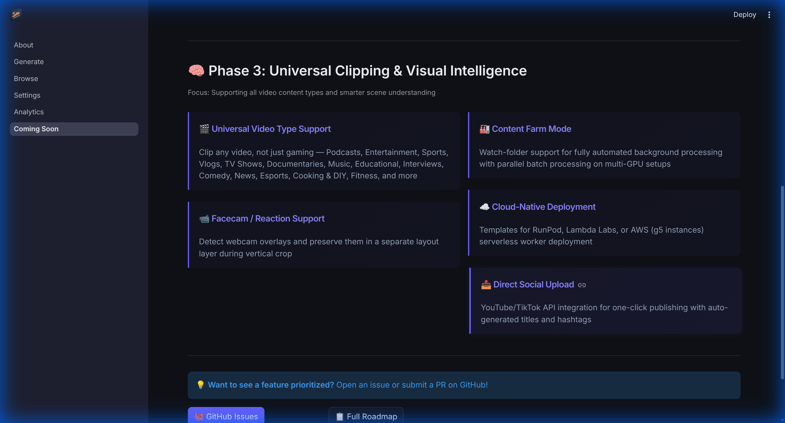

# AutoShorts

> Automatically generate viral-ready vertical short clips from long-form gameplay footage using AI-powered scene analysis, GPU-accelerated rendering, and optional AI voiceovers.

AutoShorts analyzes your gameplay videos to identify the most engaging moments—action sequences, funny fails, or highlight achievements—then automatically crops, renders, and adds subtitles or AI voiceovers to create ready-to-upload short-form content.


[](LICENSE)

---

## 🎬 Example Output

Here are some shorts automatically generated from gameplay footage:

| sample 1 | sample 2 | sample 3 | sample 4 |
| :---: | :---: | :---: | :---: |
|  |  |  |  |

### 🎥 Showcase: Multi-Language & Style Generation

AutoShorts automatically adapts its editing style, captions, and voiceover personality based on the content and target language. Here are some examples generated entirely by the pipeline:

| Content | Style | Language | Video |
| :--- | :--- | :--- | :--- |
| **Fortnite** | Story Roast | 🇺🇸 English | [Watch Part 1](https://www.youtube.com/shorts/tTUipTAdBlk) |
| **Indiana Jones** | GenZ Slang | 🇺🇸 English | [Watch Part 1](https://www.youtube.com/shorts/VAOlR5RAX14) |
| **Battlefield 6** | Dramatic Story | 🇯🇵 Japanese | [Watch Part 1](https://www.youtube.com/shorts/DYNEr1CzTpY) |
| **Indiana Jones** | Story News | 🇨🇳 Chinese | [Watch Part 1](https://www.youtube.com/shorts/kGRrpu66fpk) |
| **Fortnite** | Story Roast | 🇪🇸 Spanish | [Watch Part 1](https://www.youtube.com/shorts/5QcelWS1oSo) |
| **Fortnite** | Story Roast | 🇷🇺 Russian | [Watch Part 1](https://www.youtube.com/shorts/A06FdnycTYo) |
| **Indiana Jones** | Auto Gameplay | 🇧🇷 Portuguese | [Watch Part 1](https://www.youtube.com/shorts/qDFsTnH9qxc) |

---

## ✨ Features

### 🎯 AI-Powered Scene Analysis

- **Multi-Provider Support**: Choose between **OpenAI** (GPT-5-mini, GPT-4o) or **Google Gemini** for scene analysis, or run in `local` mode with heuristic scoring (no API needed)
- **Gemini Deep Analysis Mode** 🧠: Upload full video to Gemini for context-aware scene detection — the AI sees the whole game, not just short clips
- **7 Semantic Types** (all analyzed automatically):
  - `action` — Combat, kills, intense gameplay, close calls
  - `funny` — Fails, glitches, unexpected humor, comedic timing
  - `clutch` — 1vX situations, comebacks, last-second wins
  - `wtf` — Unexpected events, "wait what?" moments, random chaos
  - `epic_fail` — Embarrassing deaths, tragic blunders, game-losing mistakes
  - `hype` — Celebrations, "LET'S GO" energy, peak excitement
  - `skill` — Trick shots, IQ plays, advanced mechanics, impressive techniques

### 🎙️ Subtitle Generation

- **Speech Mode**: Uses OpenAI Whisper to transcribe voice/commentary
- **AI Captions Mode**: AI-generated contextual captions for gameplay without voice
- **Caption Styles**:
  - Classic: `gaming`, `dramatic`, `funny`, `minimal`
  - **GenZ Mode** ✨: `genz` - Slang-heavy reactions ("bruh 💀", "no cap", "finna")
  - **Story Modes** ✨: Narrative-style captions
    - `story_news` - Professional esports broadcaster
    - `story_roast` - Sarcastic roasting commentary
    - `story_creepypasta` - Horror/tension narrative
    - `story_dramatic` - Epic cinematic narration
  - `auto` - Auto-match style to detected semantic type
- **PyCaps Integration**: Multiple visual templates including `hype`, `retro-gaming`, `neo-minimal`
- **AI Enhancement**: Semantic tagging and emoji suggestions (e.g., "HEADSHOT! 💀🔥")

### 🔊 AI Voiceover (Qwen3-TTS)

- **Voice Design Engine**: Powered by **Qwen3-TTS 1.7B-VoiceDesign** for creating unique voices from natural language descriptions
- **Dynamic Voice Generation**: AI automatically generates voice persona based on caption style + caption content
- **Style-Adaptive Voices**: Each caption style has a unique voice preset:
  - GenZ → Casual energetic voice with modern slang
  - Story News → Professional broadcaster
  - Story Roast → Sarcastic playful narrator
  - Story Creepypasta → Deep ominous voice with tension
  - Story Dramatic → Epic movie-trailer narrator
- **Natural Language Instructions**: Define voice characteristics via text prompts without needing reference audio
- **Ultra-Low Latency**: Local inference with FlashAttention 2 optimization
- **Multilingual Support**: Native support for 10+ languages including English, Chinese, Japanese, Korean
- **Smart Mixing**: Automatic ducking of game audio when voiceover plays

### ⚡ GPU-Accelerated Pipeline

- **Scene Detection**: Custom implementation using `decord` + PyTorch on GPU
- **Audio Analysis**: `torchaudio` on GPU for fast RMS and spectral flux calculation
- **Video Analysis**: GPU streaming via `decord` for stable motion estimation
- **Image Processing**: `cupy` (CUDA-accelerated NumPy) for blur and transforms
- **Rendering**: PyTorch + **NVENC** hardware encoder for ultra-fast rendering

### 📐 Smart Video Processing

- Scenes ranked by combined action score (audio 0.6 + video 0.4 weights)
- Configurable aspect ratio (default 9:16 for TikTok/Shorts/Reels)
- Smart cropping with optional blurred background for non-vertical footage
- Retry logic during rendering to avoid spurious failures

### 🛡️ Robust Fallback System

AutoShorts is designed to work even when optimal components fail:

| Component | Primary | Fallback |
| :--- | :--- | :--- |
| **Video Encoding** | NVENC (GPU) | libx264 (CPU) |
| **Subtitle Rendering** | PyCaps (styled) | FFmpeg burn-in (basic) |
| **AI Analysis** | OpenAI/Gemini API | Heuristic scoring (`local` mode) |
| **TTS Device** | GPU (6GB+ VRAM) | CPU Fallback (slower) |

---

## 📋 Requirements

### Hardware

- **NVIDIA GPU** with CUDA support (6GB+ VRAM recommended for Qwen3-TTS 1.7B)
- **NVIDIA Drivers** and **System RAM** (16GB+ recommended)

### Software

- Python 3.10
- FFmpeg 4.4.2 (for Decord compatibility)
- CUDA Toolkit with `nvcc` (for building Decord from source)
- System libraries: `libgl1`, `libglib2.0-0`

---

## 🚀 Installation

### Option 1: Makefile Installation (Recommended)

The Makefile handles everything automatically—environment creation, dependency installation, and building Decord with CUDA support.

```bash
git clone https://github.com/divyaprakash0426/autoshorts.git
cd autoshorts

# Run the installer (uses conda/micromamba automatically)
make install

# Setup environment variables
cp .env.example .env
# Edit .env and add your API keys (Gemini/OpenAI) 

# Activate the environment
overlay use .venv/bin/activate.nu    # For Nushell
# OR
source .venv/bin/activate            # For Bash/Zsh
```

The Makefile will:

1. Download micromamba if conda/mamba is not found
2. Create a Python 3.10 environment with FFmpeg 4.4.2
3. Install NV Codec Headers for NVENC support
4. Build Decord from source with CUDA enabled
5. Install all pip requirements

### Option 2: Docker (GPU Required)

**Prerequisite**: [NVIDIA Container Toolkit](https://docs.nvidia.com/datacenter/cloud-native/container-toolkit/install-guide.html) must be installed.

```bash
# Build the image
docker build -t autoshorts .

# Run with GPU access
docker run --rm \
    --gpus all \
    -v $(pwd)/gameplay:/app/gameplay \
    -v $(pwd)/generated:/app/generated \
    --env-file .env \
    autoshorts
```

> **Note**: The `--gpus all` flag is essential for NVENC and CUDA acceleration.

---

## ⚙️ Configuration

Copy `.env.example` to `.env` and configure:

```bash
cp .env.example .env
```

### Key Configuration Options

| Category | Variable | Description |
| :--- | :--- | :--- |
| **AI Provider** | `AI_PROVIDER` | `openai`, `gemini`, or `local` (heuristic-only, no API) |
| | `VIDEO_TYPE` | Content type preset (`gaming`, `podcasts`, `sports`, `educational`, etc.) used for universal clipping + caption style defaults |
| | `AI_ANALYSIS_ENABLED` | Enable/disable AI scene analysis |
| | `GEMINI_DEEP_ANALYSIS` | Gemini-only: upload full video for smarter scene detection (slower initial upload, better results) |
| | `OPENAI_MODEL` | Model for analysis (e.g., `gpt-5-mini`) |
| | `AI_SCORE_WEIGHT` | How much to weight AI vs heuristic (0.0-1.0) |
| **Semantic Analysis** | `SEMANTIC_TYPES` | All 7 types analyzed: `action`, `funny`, `clutch`, `wtf`, `epic_fail`, `hype`, `skill` |
| | `CANDIDATE_CLIP_COUNT` | Number of clips to analyze |
| **Subtitles** | `ENABLE_SUBTITLES` | Enable subtitle generation |
| | `SUBTITLE_MODE` | `speech` (Whisper), `ai_captions`, or `none` |
| | `CAPTION_STYLE` | Gaming styles + story/genz + universal styles like `podcast_quote`, `sports_playbyplay`, `educational_explainer`, `news_breaking`, or `auto` |
| | `PYCAPS_TEMPLATE` | Visual template for captions |
| **TTS Voiceover** | `ENABLE_TTS` | Enable Qwen3-TTS voiceover |
| | `TTS_LANGUAGE` | Language code (`en`, `zh`, `ja`, `ko`, `de`, `fr`, `ru`, `pt`, `es`, `it`) |
| | `TTS_VOICE_DESCRIPTION` | Natural language voice description (auto-generated if empty) |
| | `TTS_GAME_AUDIO_VOLUME` | Game audio volume when TTS plays (0.0-1.0, default 0.3) |
| | `TTS_VOICEOVER_VOLUME` | TTS voiceover volume (0.0-1.0, default 1.0) |
| **Video Output** | `TARGET_RATIO_W/H` | Aspect ratio (default 9:16) |
| | `SCENE_LIMIT` | Max clips per source video |
| | `MIN/MAX_SHORT_LENGTH` | Clip duration bounds (seconds) |

See `.env.example` for the complete list with detailed descriptions.

---

## 📖 Usage

1. **Place source videos** in the `gameplay/` directory
2. **Run the script**:

   ```bash
   python run.py
   ```

3. **Generated clips** are saved to `generated/`

### 🧭 Dashboard (Streamlit UI)

Launch the local dashboard to configure settings, start jobs, and preview clips:

```bash
streamlit run src/dashboard/About.py
```

| About | Generate | Browse |
| :---: | :---: | :---: |
|  |  |  |

| Features | Settings | Roadmap |
| :---: | :---: | :---: |
|  |  |  |

### Output Structure

```text
generated/
├── video_name scene-0.mp4          # Rendered short clip
├── video_name scene-0_sub.json     # Subtitle data
├── video_name scene-0.ffmpeg.log   # Render log
├── video_name scene-1.mp4
└── ...
```

---

## 🧪 Development

### Linting

```bash
pip install ruff
ruff check .
```

### Running Tests

```bash
pytest -q
```

> Tests mock GPU availability and can run in standard CI environments.

### Debug Variables

For faster iteration during development, you can skip expensive steps using these environment variables in your `.env`:

| Variable | Description |
| :--- | :--- |
| `DEBUG_SKIP_ANALYSIS=1` | Skip AI scene analysis (uses cached/heuristic scores) |
| `DEBUG_SKIP_RENDER=1` | Skip video rendering (useful for testing analysis only) |
| `DEBUG_RENDERED_CLIPS="path1:category,path2"` | Test with specific pre-rendered clips |

Example workflow for testing subtitles only:

```bash
# In .env
DEBUG_SKIP_ANALYSIS=1
DEBUG_SKIP_RENDER=1
DEBUG_RENDERED_CLIPS="generated/test_clip.mp4:action"
```

---

## 🔧 Troubleshooting

| Issue | Solution |
| :--- | :--- |
| **"CUDA not available"** | Ensure `--gpus all` (Docker) or CUDA toolkit is installed |
| **NVENC Error** | Falls back to `libx264` automatically; check GPU driver |
| **PyCaps fails** | Falls back to FFmpeg burn-in subtitles automatically |
| **Decord EOF hang** | Increase `DECORD_EOF_RETRY_MAX` or set `DECORD_SKIP_TAIL_FRAMES=300` |
| **API rate limits** | Switch to `gpt-5-mini` (10M free tokens/day) or use `local` provider |

---

## 🤝 Contributing & Roadmap

We love contributions! Whether you're fixing a bug, adding a feature, or improving documentation:

- Check out our **[Contributing Guide](CONTRIBUTING.md)** to get started.
- See the **[Roadmap](ROADMAP.md)** for our future plans (YOLO Auto-Zoom, Next-Gen TTS, etc.).

---

## 🙏 Acknowledgments

This project builds upon the excellent work of:

- **[artryazanov/shorts-maker-gpu](https://github.com/artryazanov/shorts-maker-gpu)** — Heuristics-based shorts maker
- **[Binary-Bytes/Auto-YouTube-Shorts-Maker](https://github.com/Binary-Bytes/Auto-YouTube-Shorts-Maker)** — Original concept and inspiration

---

## 📄 License

This project is licensed under the [MIT License](LICENSE).

[](https://www.buymeacoffee.com/divyaprakash0426)

**Note: All donations go to charity.**
