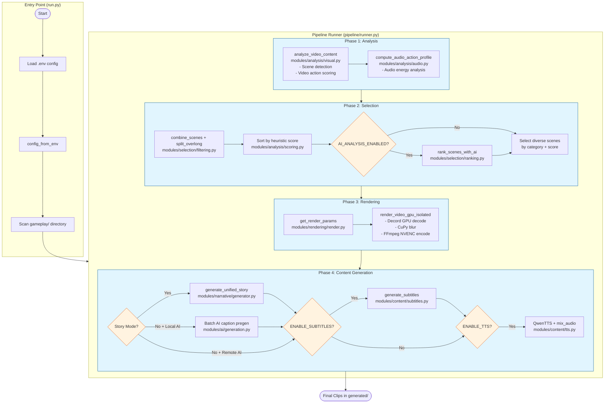
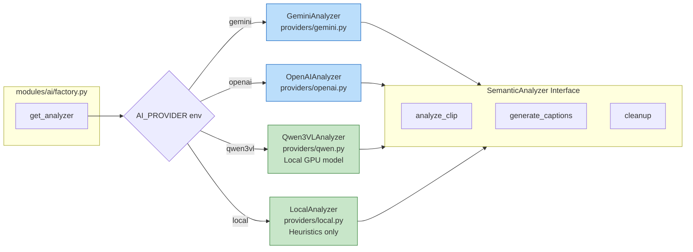
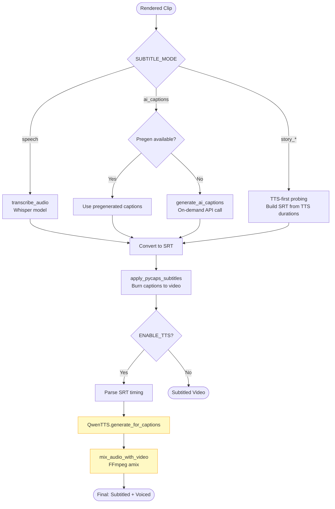
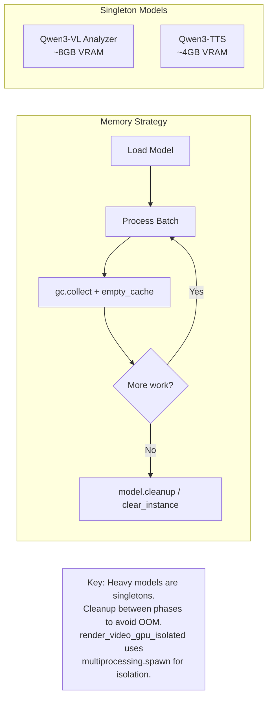

# AutoShorts: Modular Architecture Flow Diagram

This file documents the end-to-end flow for the refactored modular AutoShorts codebase. The system processes videos through distinct phases: Analysis, Selection, Rendering, and Content Generation (Subtitles/TTS).

## Architecture Overview

```
src/
├── core/                    # Shared types, config, utilities
│   ├── config.py           # ProcessingConfig from environment
│   ├── types.py            # RenderParams, VideoAnalysisResult
│   └── utils.py            # Memory logging, helpers
├── modules/
│   ├── ai/                 # AI Provider abstraction
│   │   ├── base.py         # SemanticAnalyzer abstract class
│   │   ├── factory.py      # get_analyzer() factory
│   │   ├── generation.py   # generate_ai_captions()
│   │   └── providers/      # Gemini, OpenAI, Qwen3VL, Local
│   ├── analysis/           # Video/Audio analysis
│   │   ├── visual.py       # Scene detection, action scoring (GPU)
│   │   ├── audio.py        # Audio action profile (GPU)
│   │   └── scoring.py      # Heuristic scoring functions
│   ├── selection/          # Scene filtering & ranking
│   │   ├── filtering.py    # combine_scenes, split_overlong
│   │   └── ranking.py      # AI-assisted ranking, diversity
│   ├── rendering/          # GPU video rendering
│   │   ├── render.py       # render_video_gpu, get_render_params
│   │   └── filters.py      # Blur filters (PyTorch/CuPy)
│   ├── content/            # Subtitles & TTS
│   │   ├── subtitles.py    # generate_subtitles, Whisper, PyCaps
│   │   └── tts.py          # QwenTTS, mix_audio_with_video
│   └── narrative/          # Story generation
│       └── generator.py    # generate_unified_story()
├── pipeline/
│   └── runner.py           # Main orchestration logic
└── dashboard/              # Streamlit UI (optional)
```

## Main Processing Flow



## AI Provider Flow



## Subtitle & TTS Flow



## GPU Memory Management



## Key Configuration (.env)

| Variable | Module | Description |
|----------|--------|-------------|
| `TARGET_RATIO_W/H` | rendering/render.py | Output aspect ratio (default: 9:16) |
| `AI_PROVIDER` | ai/factory.py | gemini, openai, qwen3vl, local |
| `AI_ANALYSIS_ENABLED` | selection/ranking.py | Enable AI scene ranking |
| `ENABLE_SUBTITLES` | content/subtitles.py | Generate/burn subtitles |
| `ENABLE_TTS` | content/tts.py | Generate voiceover |
| `SUBTITLE_MODE` | content/subtitles.py | speech, ai_captions, story_* |
| `CAPTION_STYLE` | content/subtitles.py | gaming, cinematic, story_epic, etc. |
| `SCENE_LIMIT` | pipeline/runner.py | Max clips per video |

## File References

| Component | File Path |
|-----------|-----------|
| Entry point | `run.py` |
| Pipeline orchestration | `src/pipeline/runner.py` |
| Configuration | `src/core/config.py` |
| Scene detection | `src/modules/analysis/visual.py` |
| Audio analysis | `src/modules/analysis/audio.py` |
| Scene scoring | `src/modules/analysis/scoring.py` |
| Scene filtering | `src/modules/selection/filtering.py` |
| AI ranking | `src/modules/selection/ranking.py` |
| GPU rendering | `src/modules/rendering/render.py` |
| Blur filters | `src/modules/rendering/filters.py` |
| AI providers | `src/modules/ai/providers/*.py` |
| Subtitles | `src/modules/content/subtitles.py` |
| TTS | `src/modules/content/tts.py` |
| Story generation | `src/modules/narrative/generator.py` |
| Dashboard UI | `src/dashboard/` |

---

*File: docs/flow_diagram.md*
*Updated for modular architecture refactor*