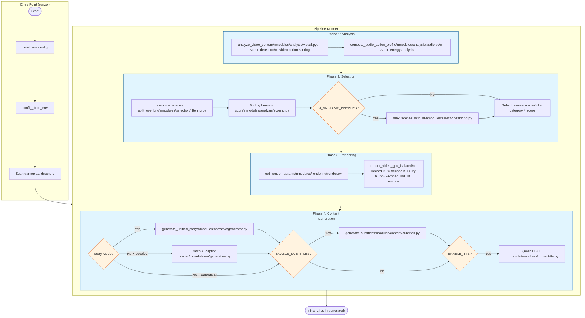

# AutoShorts: Flow Diagram Documentation

This file documents the end-to-end flow for AutoShorts. The system processes videos through distinct phases: Analysis, Selection, Rendering, and Content Generation (Subtitles/TTS).

## Architecture Overview

```
src/
├── ai_providers.py         # AI Provider abstraction (Gemini, OpenAI, Local)
├── shorts.py               # Main pipeline orchestration
├── subtitle_generator.py   # Subtitle generation + PyCaps rendering
├── tts_generator.py        # Qwen3-TTS VoiceDesign + audio mixing
├── story_narrator.py       # Unified story narration generation
└── dashboard/              # Streamlit UI (optional)
```

## Key Flows

### 1. Scene Selection Flow

```
Input Video
    │
    ├── GEMINI_DEEP_ANALYSIS=true ──► 🧠 Deep Analysis Mode
    │                                  • Gemini scans full video
    │                                  • Finds highlight moments directly
    │                                  • Bypasses heuristic scoring
    │
    └── GEMINI_DEEP_ANALYSIS=false ──► Heuristic + AI Ranking
                                        • Scene detection
                                        • Audio/video action scoring
                                        • Optional AI semantic ranking
```

### 2. Story Mode Subtitle Flow (NEW - TTS-First Architecture)

The critical fix for story mode ensures subtitles are not lost when TTS extends video:

```
Story Narration Generated
         │
         ▼
┌─────────────────────────────────┐
│ 1. Generate TTS FIRST           │  ◄── Measure actual audio duration
│    Qwen3-TTS VoiceDesign        │
│    Save to .story_tts.wav       │
└─────────────────────────────────┘
         │
         ▼
    TTS > Video + 1s?
    ┌────┴────┐
   Yes        No
    │         │
    ▼         ▼
┌───────────────────────┐  ┌────────────────┐
│ 2. Re-render Video    │  │ Use original   │
│    BEFORE PyCaps      │  │ video          │
│    Extend to TTS      │  │                │
│    duration           │  │                │
└───────────────────────┘  └────────────────┘
         │                        │
         └────────┬───────────────┘
                  ▼
┌─────────────────────────────────┐
│ 3. Apply PyCaps Subtitles       │  ◄── On correctly-sized video!
│    Output: .mp4 format          │
│    Detect: SRT-based _sub.mp4   │
└─────────────────────────────────┘
         │
         ▼
┌─────────────────────────────────┐
│ 4. Mix Pre-generated TTS        │  ◄── No re-render needed
│    render_meta=None             │      Video already correct size
│    Preserves subtitles!         │
└─────────────────────────────────┘
         │
         ▼
      Final Video
    (Subtitles + TTS)
```

### 3. PyCaps Output Detection

PyCaps may save output with different naming conventions:

```python
# Detection priority order:
1. output_path                    # What we requested
2. srt_path.stem + "_sub.mp4"     # Based on SRT filename (scene-0_sub.mp4)
3. video_path.stem + "_sub.mp4"   # Based on video filename
4. _check_for_fallback_output()   # Recent output_*.mp4 files
5. FFmpeg fallback                # Last resort
```

### 4. Audio Mixing

```
Video (with subtitles)
         │
         ▼
    Has audio stream?
    ┌────┴────┐
   Yes        No (PyCaps output)
    │         │
    ▼         ▼
┌──────────────────┐  ┌──────────────────┐
│ amix: blend      │  │ Add TTS as only  │
│ game + TTS       │  │ audio track      │
└──────────────────┘  └──────────────────┘
```

## Main Processing Flow (Mermaid)

See `flow_diagram.mmd` for the full Mermaid diagram, rendered to `flow_diagram.png`.



## Key Configuration (.env)

| Variable | Description |
|----------|-------------|
| `GEMINI_DEEP_ANALYSIS` | Enable full-video Deep Analysis mode |
| `AI_PROVIDER` | gemini, openai, local |
| `AI_ANALYSIS_ENABLED` | Enable AI scene ranking |
| `ENABLE_SUBTITLES` | Generate/burn subtitles |
| `ENABLE_TTS` | Generate voiceover |
| `SUBTITLE_MODE` | speech, ai_captions, story_* modes |
| `CAPTION_STYLE` | gaming, dramatic, story_roast, story_dramatic, etc. |
| `TTS_LANGUAGE` | en, ja, ko, zh, de, fr, ru, pt, es, it |
| `TTS_GAME_AUDIO_VOLUME` | Game audio volume when mixed (default: 0.3) |
| `TTS_VOICEOVER_VOLUME` | TTS volume (default: 1.0) |

## Story Modes

| Mode | Voice Preset | Description |
|------|--------------|-------------|
| `story_news` | Male esports broadcaster | Energetic, fast-paced |
| `story_roast` | Male sarcastic comedian | Playful mockery |
| `story_dramatic` | Female theatrical narrator | Epic, momentous |
| `story_creepypasta` | Male ominous voice | Dark, unsettling |

## Multi-Language Support

When `TTS_LANGUAGE` is set to a non-English language:

- AI captions/narration generated in target language
- Culturally appropriate style adaptations
- Voice presets use English descriptions (TTS understands regardless)

## Key Optimizations

1. **Story Mode TTS-First**: Video extended BEFORE subtitles to prevent loss
2. **PyCaps Detection**: Multiple fallback paths for output detection  
3. **No-Audio Fallback**: Handle PyCaps outputs without audio tracks
4. **VRAM Management**: Unload models between phases
5. **Re-render Only When Needed**: TTS > clip + 1.5s threshold

---

*File: docs/flow_diagram.md*  
*Updated: 2026-02-08 - Story Mode TTS-First Architecture*
